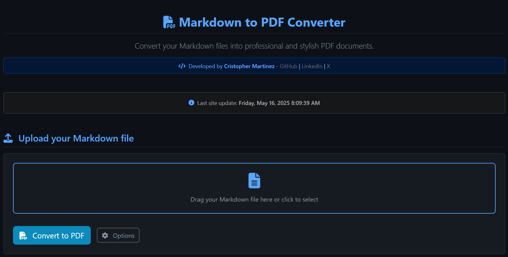

# Markdown to PDF Converter 📄➡️📑



## 🔍 Project Overview

This project is a web application designed to convert Markdown files into PDF documents. It utilizes Node.js with Express for the backend, Puppeteer for PDF generation, and `markdown-it` for Markdown parsing. The frontend is built with HTML, Bootstrap 5, and JavaScript to provide a user-friendly interface.

**Core Functionality:**

- **📝➡️📄 Markdown to PDF Conversion:** The primary purpose is to take a Markdown file (`.md`) as input and produce a professional-looking PDF document.
- **⚙️ Customization Options:** Users can customize various aspects of the PDF output, including:
  - Page size (A4, Letter, Legal, etc.)
  - Page orientation (portrait, landscape)
  - Margins (top, bottom, left, right)
  - Code block syntax highlighting themes (e.g., GitHub, Monokai)
  - Colorblind-friendly themes
  - Custom CSS for fine-grained styling
  - Custom header and footer templates
- **📁 File Upload & Management:**
  - Users can upload Markdown files through a web interface.
  - The server stores uploaded files temporarily in an `uploads/` directory.
  - Generated PDF and HTML preview files are stored in a `public/` directory.
  - Users can view a list of generated files and delete them.
- **👁️ Live Preview:** An HTML preview of the Markdown content is generated alongside the PDF, allowing users to see how their document will look before or after conversion.
- **🧪 Example Conversion:** A built-in example using a `README.md` file demonstrates the conversion process.
- **🎨 Theming:** The web interface supports light and dark themes for user preference.

## 🛠️ Key Technologies Used

- **Node.js:** JavaScript runtime environment for the backend.
- **Express.js:** Web application framework for Node.js, used to create the server and API endpoints.
- **Puppeteer:** A Node library that provides a high-level API to control headless Chrome or Chromium. It's used here to render HTML (generated from Markdown) and then print it to a PDF.
- **`markdown-it`:** A Markdown parser, extensible and fast. It converts Markdown text into HTML.
- **`highlight.js`:** A library for syntax highlighting of code blocks within the Markdown content.
- **Multer:** Middleware for handling `multipart/form-data`, which is primarily used for uploading files.
- **Bootstrap 5:** A popular CSS framework for building responsive and modern web interfaces.
- **Font Awesome:** Provides a library of icons used in the UI.
- **Nodemon (devDependencies):** A utility that monitors for any changes in your source and automatically restarts your server, useful during development.

## 📂 File Structure and Purpose

- `server.js`: The main entry point for the backend application. It sets up the Express server, defines routes for handling file uploads, conversion requests, and file management.
- `convert.js`: Contains the core logic for converting Markdown content to PDF using `markdown-it` for parsing and Puppeteer for PDF generation. It handles various customization options.
- `setup.js`: A utility script, typically run during or after installation, to create necessary directories like `uploads/` (for temporary file storage) and `public/` (for storing generated PDFs and HTML previews).
- `index.html`: The main HTML file for the web interface. It provides the user interface for uploading files, setting conversion options, and viewing results.
- `previewTemplate.js`: A JavaScript file likely used to generate or enhance the HTML structure for the live preview of the Markdown content, integrating styles and scripts.
- `package.json`: The project manifest file. It lists project dependencies (like Express, Puppeteer), development dependencies (like Nodemon), and defines npm scripts for common tasks (starting the server, running setup).
- `README.md`: This file, containing documentation about the project, its setup, and usage.
- `text.md`: A sample Markdown file included for testing the conversion functionality.
- `js/main.js` & `js/script.js`: Client-side JavaScript files that handle the interactivity of `index.html`, such as form submissions, API calls to the backend, and dynamic updates to the UI.
- `public/`: This directory is used to serve static assets and, more importantly, to store the generated HTML previews and PDF documents, making them accessible via a URL.
- `uploads/`: This directory temporarily stores Markdown files uploaded by the user before they are processed for conversion.

## 📚 How to Use the Project

1. **🔧 Prerequisites:**

   - Node.js and npm (Node Package Manager) must be installed on your system.

2. **💻 Installation:**

   - Clone or download the project repository to your local machine.
   - Open a terminal or command prompt and navigate to the project's root directory.
   - Run the command:

     ```bash
     npm install
     ```

     This command installs all the necessary dependencies listed in `package.json`. It will also automatically run the `postinstall` script, which executes `node setup.js` to create the `uploads/` and `public/` directories if they don't exist.

   - If the directories are not created automatically, you can run the setup script manually:

     ```bash
     npm run setup
     ```

3. **🚀 Running the Application:**

   - **Development Mode:** For development, it's recommended to use Nodemon, which automatically restarts the server when file changes are detected.

     ```bash
     npm run dev
     ```

   - **Production Mode:** To start the server in a standard way:

     ```bash
     npm start
     ```

   - **🐳 Running with Docker Compose:** If you have Docker and Docker Compose installed, you can build and run the project using:

     ```bash
     docker-compose up --build
     ```

     This command will build the Docker image if it doesn't exist and start the service defined in `docker-compose.yml`. The application will typically be accessible at `http://localhost:3000` as specified in the Docker Compose configuration.
     To stop and remove the containers, networks, and volumes created by `up`, you can run:

     ```bash
     docker-compose down
     ```

   - Once the server is running (either directly or via Docker), you will see a message in the terminal, typically: `Server started at http://localhost:3000`.

4. **🌐 Accessing the Web Interface:**

   - Open your web browser (e.g., Chrome, Firefox).
   - Navigate to `http://localhost:3000`.

5. **🔄 Converting a Markdown File:**

   - On the web page, you will find an upload area. Click it to select a Markdown file (`.md`) from your computer, or drag and drop a file onto the area.
   - Once a file is selected, you can configure various PDF generation options presented on the page (e.g., page size, orientation, margins, code theme).
   - Click the "Convert" or a similarly labeled button.
   - After processing, the application will provide links to download the generated PDF and to view an HTML preview of the document.

6. **🧩 Using the Example Conversion:**

   - The interface might offer an option to convert the project's `README.md` (or another sample file like `text.md`) as a demonstration. This allows you to quickly see the converter in action without uploading your own file.

7. **📋 Managing Generated Files:**

   - The web interface typically includes a section that lists all HTML and PDF files generated and stored in the `public/` directory.
   - From this list, you can usually view or delete these files.

8. **⏹️ Stopping the Server:**
   - To stop the server, go back to the terminal window where it's running and press `Ctrl+C`.

## 📦 NPM Scripts

The `package.json` file defines several scripts for convenience:

- `npm run setup`: Executes `node setup.js` to ensure necessary project directories (`uploads/`, `public/`) are created. This is also run automatically after `npm install` due to the `postinstall` hook.
- `npm run convert`: Executes `node convert.js`. This script likely provides a command-line interface (CLI) way to convert a predefined Markdown file (e.g., `text.md`) directly, without using the web server.
- `npm start`: Executes `node server.js` to start the web application server. This is typically used for production or standard execution.
- `npm run dev`: Executes `nodemon server.js`. This starts the server using Nodemon, which monitors for file changes in the project and automatically restarts the server. This is very useful during development.
- `npm postinstall`: Automatically executes `node setup.js` after `npm install` successfully completes.

## 👨‍💻 Author

This project was developed by **Cristopher Martinez**, a Frontend & Backend Developer.

- **LinkedIn**: [https://www.linkedin.com/in/cristopher-dev/](https://www.linkedin.com/in/cristopher-dev/)
- **X (Twitter)**: [https://x.com/cristopher_devs](https://x.com/cristopher_devs)
- **GitHub**: [https://github.com/cristopher-dev/markdown-to-pdf](https://github.com/cristopher-dev/markdown-to-pdf)
